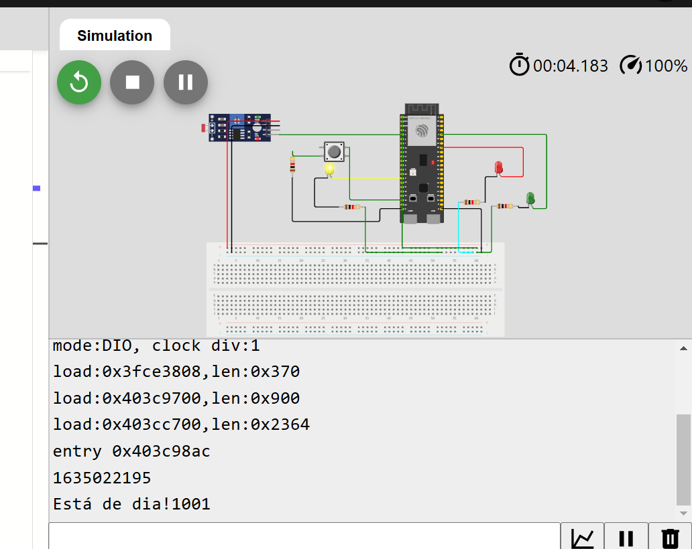
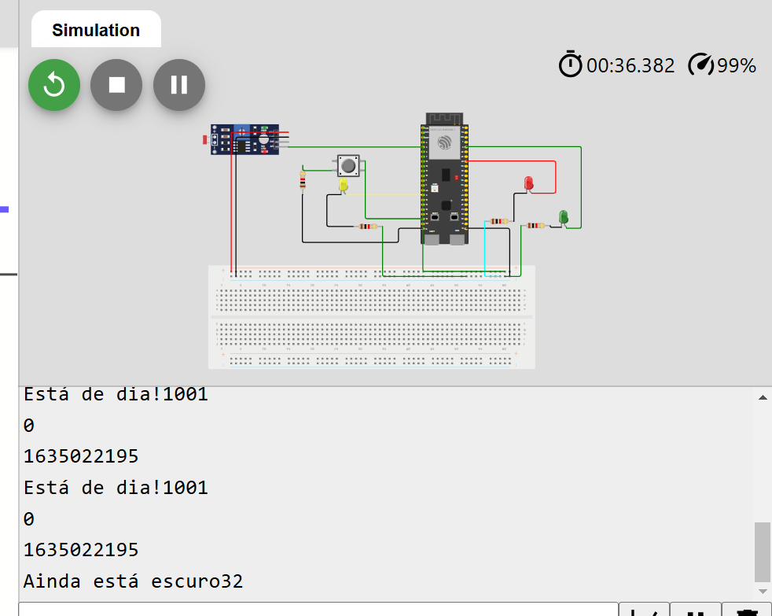

# prova-m04

## Aluno: Fernando Soares de Oliveira

Modo dia:

  Figura 1 - Modo dia 
   
  Fonte: Material produzido pelo Fernando (2024)

Modo noite:

  Figura 1 - Modo dia 
   
  Fonte: Material produzido pelo Fernando (2024)

## Código

O código foi inteiramente reformulado para português, incluindo comentários e variáveis; 
A internet foi um grande problema inicialmente, mas depois descobri que o problema era principalmente a biblioteca que deveria ser incluída no Wokwi; 
